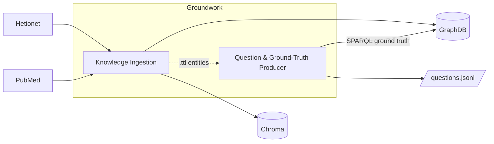
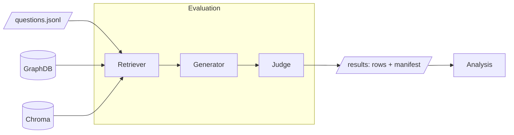

# biomedical-rag-bench

An evolving evaluation harness for retrieval-augmented generation over biomedical
knowledge [Hetionet](https://het.io/). It compares retrieval strategies: graph traversal and graph
query vs. vector similarity, others to come. All under a shared evaluation contract.

The benchmark grows by adding retriever conditions; the eval harness, question set,
generator interface, and telemetry schema are shared across all conditions and evolve
under additive-only rules.

## Architecture

The benchmark has three phases, and the canonical vocabulary below:

| Phase | Cadence | What it produces |
|---|---|---|
| **Groundwork**  | once per dataset version | **Knowledge Ingestion** Hetionet → RDF-star → GraphDB; [PubMed](https://pubmed.ncbi.nlm.nih.gov/) → embeddings → Chroma **Question & Ground-Truth Producer** question templates instantiating questions over the graph; deterministic ground truth computed by **SPARQL traversal** → `questions.jsonl` |
| **Evaluation** | per run | the **Eval Harness** orchestrating **Retriever → Generator → Judge** → `rows.jsonl` + `manifest.json` (see [Output contract](#output-contract-downstream-interface)) |
| **Analysis** | per analysis | Lightweight analysis in [jupyter notebook](analysis/explore.ipynb) |

The retrievers operate over the **same** biomedical knowledge in different
representations: [Hetionet](https://github.com/hetio/hetionet) (a curated biomedical
knowledge graph) and PubMed abstracts. Every condition sees the same entities — the comparison
is *representation, not content*. Format detail (URI schemes, RDF-star, the embedding
model) lives in the ingestion READMEs ([`ingest/rdf`](ingest/rdf/README.md),
[`ingest/vector`](ingest/vector/README.md)). 

### Architecture diagrams


<details open>
<summary><b>Image diagram</b></summary>

**Groundwork**
.png>)

</details>

<details>
<summary><b>Mermaid diagrams</b></summary>

**Groundwork**



**Evaluation**



</details>

## Repository structure


```
.
├─ ingest/                      [Groundwork]
│  ├─ rdf/                      [Groundwork]
│  ├─ vector/                   [Groundwork]
│  ├─ corpus_profile.py         [Groundwork]
│  └─ corpus/                   [Groundwork]
├─ produce/                     [Groundwork]
│  ├─ templates/                [Groundwork]
│  ├─ produce.py                [Groundwork]
│  ├─ validate.py               [Groundwork]
│  └─ questions.jsonl           [Groundwork]
├─ ontology/                    [Groundwork]
├─ retrievers/                  [Evaluation]
├─ eval/                        [Evaluation]
│  ├─ generate/                 [Evaluation]
│  ├─ judge/                    [Evaluation]
│  ├─ harness.py                [Evaluation]
│  ├─ run_eval.py               [Evaluation]
│  └─ results/                  [Evaluation]
├─ analysis/                    [Analysis]
│  ├─ load.py                   [Analysis]
│  ├─ explore.ipynb             [Analysis]
│  └─ FINDINGS.md               [Analysis]
├─ secrets/ · deployment/ · tests/ · .github/   [ops]
├─ Makefile · docker-compose.yml · pyproject.toml · uv.lock   [ops]
└─ README.md                    [—]
```
## LLM roles

An LLM can run at three points in the pipeline, each with its **own system prompt**:

| Role | What the LLM does (system prompt) |
|---|---|
| **Retriever** | Only `graph_sparqlgen` — the *SPARQL writer* — turns the question into one SPARQL `SELECT` from the schema vocabulary; every other retriever uses no LLM. (`retrievers/sparqlgen.py` → `SCHEMA_PROMPT`) |
| **Generator** | The model that answers the question from the retrieved context, or closed-book. (`eval/harness.py` → `SYSTEM_PROMPT`) |
| **Judge** | Deterministic for 9 of 10 types; an LLM scores only type-10 (fuzzy/semantic) answer↔reference equivalence. (`eval/judge/semantic.py` → `_SYSTEM`) |

Full catalogue — models, temperatures, telemetry, and the verbatim prompts — in
[`eval/llm-roles.md`](eval/llm-roles.md).

## The comparison under test

The current increment compares **five conditions** across four retriever implementations —
`graph_neighborhood` is evaluated at two traversal depths. All return the same
`RetrievalResult` shape, so the harness is condition-agnostic and differences reflect
*representation*, not measurement:

| Condition | Augmented context comes from | Role | LLM at retrieval? |
|---|---|---|---|
| `closed_book` | nothing (empty context) | **baseline** — measures whether retrieval helps at all | no |
| `vector` | top-k Chroma similarity | the control | no |
| `graph_neighborhood` (k=1) | entity-link + **1-hop** traversal of the RDF graph | isolates representation at the shallowest hop | no |
| `graph_neighborhood` (2-hop) | entity-link + **2-hop** traversal of the RDF graph | tests the same mechanism's multi-hop reach | no |
| `graph_sparqlgen` | results of an **LLM-written** SPARQL query | the realistic deployed system | yes — SPARQL writer, cost logged apart from the generator |

Both `graph_neighborhood` flavors are deterministic (**no LLM** in the loop); they differ
only in traversal depth, so the pair isolates how much multi-hop context the same mechanism
must pass as augmented context. The interface, per-condition mechanisms, and telemetry are documented in
[`retrievers/README.md`](retrievers/README.md). Ground truth is derived from graph
traversal, never from LLM generation; the question set is append-only across increments,
so prior results stay comparable.

### Hypothesis

Pure GraphRAG over RDF outperforms vector-only RAG on multi-hop, entity-dense queries, but
loses on single-fact lookup and fuzzy semantic queries. The crossover is governed by query
hop-count and entity density. This is the claim under test, not the assumed conclusion.

### Sub-hypotheses

| Hyp | Claim | How evaluated | Predicted |
|---|---|---|---|
| **H1** Token efficiency | graph uses far fewer context tokens on 2+ hop questions | scored — billed input vs `closed_book`, per type | graph ≪ vector (2+ hop); ~tie 1-hop |
| **H2** Relational hallucination | graph refuses where vector invents | scored — type 08 sensitivity/specificity | graph |
| **H3** Multi-hop recall | graph recall stays flat as hops grow; vector decays | scored — recall vs hop-count (types 02/03/04) | graph |
| **H4** Fuzzy/semantic recall | vector wins; graph may not answer at all | scored — type 10 accuracy (LLM judge) | vector |
| **H7** Retrieval necessity | closed-book matches on easy classes, fails on hard ones | scored — `closed_book` gap across types | crossover (the primary finding) |
| **H5** Compute / indexing | cheap query both sides; graph costly to index | measured (per backend) — query latency (`latency_ms`) + query token cost (mean `retrieval_context_input_tokens`, [analysis/run-cost.md](analysis/run-cost.md)) + one-time build-cost profile ([analysis/build-cost.md](analysis/build-cost.md)) | cheap query both sides; build cost is asymmetric — **measure, don't assume** |
| **H6** Citability | graph gives claim-level provenance; vector chunk-level | by construction — `sources` granularity (URIs vs chunk ids); attribution faithfulness deferred | graph |

H1–H4 and H7 are **scored per question** — each yields a number per (retriever ×
question-type) cell; scored-metric formulas live in
[`eval/README.md` → Metrics](eval/README.md#metrics). H5 and H6 are instead
**per-backend** — one value per retriever, not a per-type score — with methodology in
[`analysis/build-cost.md`](analysis/build-cost.md) and
[`analysis/run-cost.md`](analysis/run-cost.md).

**H4 is deferred to a later version** — defined here, but not part of the
`v1.*.*` comparison (see [Build order](#build-order)).

### Early observations

Recorded as they emerged during build — early signal, since superseded by the full eval runs (see [Findings](#findings)).

**Vector retrieves by language, not by biological role.** The first smoke query
(`"loss of E-cadherin promotes tumor metastasis"`) ranked CDH1 — the E-cadherin gene —
only *third*; the top hit (TRIM27) merely used language closer to "metastasis." Vector
recall is bounded by the words in the seeding abstracts, not the entity's role in the
graph — early, concrete evidence for H2/H4. Full worked example:
[`ingest/vector/README.md`](ingest/vector/README.md#smoke-test-observation).

### Findings

Published per release in `.github/release-notes/<version>.md` and on the GitHub Releases
page; durable cross-run interpretation lives in [`analysis/FINDINGS.md`](analysis/FINDINGS.md).

## Stack

Technologies keyed by the canonical components. Versions are pinned in `pyproject.toml` +
`uv.lock`, not here.

| Phase / component | Technology | Why |
|---|---|---|
| Knowledge Ingestion — RDF graph | Ontotext GraphDB Free + RDF-star Turtle | triplestore; ruleset `empty` (reasoning is the Project 3 factor). A free license is required for writes — see [`secrets/README.md`](secrets/README.md). Named *RDF graph*, not *graph*, to read distinctly against Project 4's LPG. |
| Knowledge Ingestion — vector | Chroma (embedded) + `all-MiniLM-L6-v2` | local, free, reproducible |
| Question & Ground-Truth Producer | Python + SPARQL over GraphDB | ground truth computed by traversal, never an LLM |
| Retriever | plain Python; `graph_sparqlgen` adds an LLM **SPARQL writer** (`SPARQLGEN_MODEL`) | one interface, four implementations (five conditions); writer cost logged apart from the generator |
| Generator (under test) | Anthropic / Ollama via `GENERATOR_MODEL` | generator-agnostic; fixed within a run |
| Judge | deterministic (9/10 types) + one LLM judge (`JUDGE_MODEL`) | determinism where feasible |
| Orchestration | plain Python, `uv` | no LangChain / LlamaIndex — abstraction layers obscure what is being measured |

## Output contract (downstream interface)

This repository's responsibility **ends at emitting a well-specified eval output**; a
separate consumer (`biomedical-rag-bench-analytics`) does the results modeling and
dashboards. Three artifacts form the contract:

- **`eval/results/<run_id>.jsonl`** — one row per `question × retriever × generator` trial (the grain).
- **`eval/results/<run_id>.manifest.json`** — the run-constant factors, paired one-to-one by `run_id`.
- **`produce/questions.jsonl`** + **`ingest/corpus/<id>.json`** — the frozen eval set and corpus profiles the rows reference.

Field-level schemas, with JSON examples, live in
[`eval/README.md` → Result row schema](eval/README.md#result-row-schema) and
[Run manifest schema](eval/README.md#run-manifest-schema). There is no single `run.json` —
that name is informal shorthand for the rows + manifest pair. `analysis/` consumes
exactly these and is the lift-out point for the analytics repo; analysis tooling is
deliberately **not** deepened in this repo.

## Reproducing results

`produce/questions.jsonl` ships frozen, so reproduction does **not** regenerate the question
set — it stands up the stores, then runs the eval. Per-step detail lives in the ingestion
READMEs; this is the spine.

### Prerequisites (one-time)

- **`uv`** installed — this repo has no `python`/`pip` on PATH and no `requirements.txt`.
- **`secrets/.env`** — copy `secrets/.env.example` and fill in the LLM provider key (generator,
  SPARQL writer, semantic judge) plus the optional NCBI key. See [`secrets/README.md`](secrets/README.md).
- **`secrets/graphdb.license`** — GraphDB 11 Free rejects *writes* without it (free, email-gated).
  See [`secrets/README.md`](secrets/README.md#graphdb-license-required).

### Steps

```bash
# 1. Clone and check out a specific release
git clone https://github.com/joseph-higaki/biomedical-rag-bench
cd biomedical-rag-bench
git checkout v1.0.0

# 2. Start GraphDB (mounts the license from secrets/)
docker compose up -d

# 3. Build the ingestion artifacts: data/rdf/hetionet.ttl + the Chroma collection
make ingest

# 4. Create the `hetionet` repo and stream-load the Turtle (one-time, ~5–10 min).
#    Repo config + load commands live in ingest/rdf/README.md
#    → "One-time GraphDB repository setup".

# 5. Run the eval (full retrieve → generate → judge loop). The --extra must match the
#    retriever: vector → `vector`, graph_* → `graph`; any LLM path also needs `generate`.
#    Repeat per retriever condition you want to reproduce.
uv run --extra graph --extra generate python eval/run_eval.py --run \
    --retriever graph_neighborhood_1hop --generator anthropic:claude-haiku-4-5
```

Expected runtime end-to-end: ~2 hours on a modern laptop, dominated by PubMed fetch
(rate-limited by NCBI) and embedding generation; the GraphDB load (step 4) is ~5–10 minutes.

## Roadmap & status

Work in progress; the repo evolves on `main`. "Project" is the **release/roadmap unit** —
each ships a SemVer MAJOR tag (see [Release strategy](#release-strategy)). The body above
describes the *current* increment.

| Project | Tag | Adds | Status |
|---|---|---|---|
| Project 1 — Vector RAG vs RDF GraphRAG | `v1.0.0` | the conditions above | In development |
| Project 2 — OBDA / Virtual Knowledge Graph | `v2.0.0` | the same graph served via ontology → Ontop → (PostgreSQL, then Trino-federated lakehouse) | Planned |
| Project 3 — OWL reasoning over RDF | `v3.0.0` | reasoning over the same triples | Planned |
| Project 4 — RDF vs LPG (Neo4j) | `v4.0.0` | a labeled-property-graph retriever | Planned |

**Architectural shape of the next projects.** Project 2 (OBDA) is a *serving-architecture*
track, recorded in full in [`PROJECT2-OBDA.md`](PROJECT2-OBDA.md). Its defining invariant:
answer accuracy is **held at parity**, never improved — its later phases are architectural
tests validated by *context-parity* against the GraphDB baseline, not by a RAG-accuracy
delta. It lands as new retrievers (ontology-querying text-to-SPARQL, then Ontop-backed
serving) behind the same `Retriever` protocol. Project 3 adds reasoning as a *factor*, not a
retriever: the GraphDB ruleset moves `empty` → OWL and the TBox in
`ontology/hetionet-schema.ttl` drives inference, but the existing graph retrievers query the
reasoning-enabled store **unchanged**, so the same `graph_neighborhood`/`graph_sparqlgen`
code yields new *conditions* (`@ reasoning=owl`) — "same query, different store semantics."
Project 4 adds LPG as a *new retriever* (`retrievers/lpg.py` + `ingest/lpg/` + a Neo4j
service), since it changes the store, the query language (Cypher), and the ingestion path.

### Build order

Project 1 follows a strict build order — each step validates before the next begins.
Granular per-session progress lives in the session journal.

- [x] **1. Smoke test the pipeline end-to-end on a tiny slice.**
  - [x] Hetionet JSON → RDF-star Turtle via a streaming transform; 100-edge connected slice
  - [x] SPARQL and SPARQL-star return real answers (validated offline with pyoxigraph)
  - [x] Load the slice into GraphDB and confirm the same queries against the live triplestore (see `ingest/rdf/hetionet-data-notes.md` for the RDF-star count note)
  - [x] PubMed → 5 abstracts → Chroma → one similarity query returning a real answer
- [x] **2. Author question templates.** One or more templates per type in the ten-type taxonomy; each specifies the question shape, the ground-truth query, the type, and the entity sampling strategy. Templates are authored, not LLM-generated. **Done:** all ten types in `produce/templates/` (each a `<name>.yaml` + `ground_truth/<name>.rq`), registry in [produce/templates/README.md](produce/templates/README.md).
- [x] **3. Build the eval producer.** Loads templates, samples entities programmatically (seeded), runs the ground-truth query per instantiated question, writes `questions.jsonl`. **Done:** `produce/` emits 58 questions across all ten types, validated. See [produce/README.md](produce/README.md).
- [x] **4. Build the retriever interface and retrievers.** All implement the `Retriever` protocol in `retrievers/base.py`. **Done:** `closed_book`, `vector`, `graph_neighborhood` (1/2-hop), and `graph_sparqlgen`, registered in `eval/run_eval.py`. See [retrievers/README.md](retrievers/README.md).
- [x] **5. Build the eval harness and judges.** **Done:** `eval/harness.py` (retrieve → generate → judge, run via `eval/run_eval.py --run`), the provider-agnostic generator in `eval/generate/` (Anthropic + Ollama), and all six judges in `eval/judge/` (five deterministic + the `semantic` LLM judge), all tested. Remaining sub-items are follow-ups, not blockers.
  - [ ] *(low priority)* **Shared config module.** Consolidate the per-script `find_dotenv("secrets/.env")` into a `config.py` exposing an immutable `settings`, fail-fast on required keys. Only worth it once there's a second consumer — don't land dead code.
  - [x] **Architecture diagrams.** The container view is above. Remaining: a component-level diagram per subsystem and an end-to-end sequence diagram once producer → harness → judge are diagrammed together.
  - [ ] **Architectural doc review of the three LLM roles.** Fold [eval/llm-roles.md](eval/llm-roles.md) into the component-level diagrams (the roles as distinct nodes, not one "LLM" box) and reconcile across the eval/retriever READMEs.
  - [ ] **(pending follow-up) Calibrate the type-10 `semantic` LLM judge (Cohen's kappa).** Built but **not yet trusted**: it earns trust only after agreement with human grades clears kappa > 0.7 over a ≥20-question hold-out. **Blocked on expanding the append-only type-10 set** (only 6 today, all textbook-famous, so they don't yet test H4). Until it lands, **do not cite type-10 accuracy as calibrated** (first-run verdicts were spot-checked 12/12 — promising, not the formal study).
  - [x] **Full vector corpus (parallel fetcher).** `pubmed_fetch.py` rewritten to a thread pool behind a global NCBI-rate cap (≈11 h → ≈1.7 h for all ~29k literature-kind entities); resumable via the per-entity file cache.
- [x] **6. Verify the full eval pipeline on a question subset.** Run the integrated pipeline end-to-end on a small subset (against GraphDB) and confirm metrics for all conditions. **Done:** all five conditions run on a 10-question cross-type slice against the live triplestore (11.3M triples), fixed generator `claude-haiku-4-5`; deterministic metrics reproduce the canonical ordering (closed_book < vector < graph; sparqlgen highest), and the runs flow through `analysis/load.py` dedup. The sweep is `make eval-full` (full set; subset via `--limit`).
- [x] **7. Scale to full Hetionet and full question set (~58).** **Done:** full graph loaded (11.27M triples); a complete 58-question sweep across all five conditions ran 2026-06-14 (deterministic + semantic judge). This session's subset run re-verified the pipeline end-to-end after the analysis-layer refactor and GraphDB recovery.
- [x] **8. Ship `v1.0.0` — the deterministic comparison.** Definitive full run, analysis + findings writeup, then tag + GitHub release. **Scope:** types 01–09 (deterministic judges) → hypotheses **H1, H2, H3, H7** (scored per question) and **H5, H6** (per-backend: H5 a measured build/latency profile, H6 fixed by `sources` construction). **H4 / type-10 is explicitly excluded** and must not be cited as calibrated (see the pending item below).

**Pending / deferred (not gating `v1.0.0`).**

- [ ] **(`v1.1.0`) Calibrate the type-10 `semantic` judge → land H4.** Two coupled gaps: the 6 type-10 questions are textbook-famous (closed-book answers them from memory, so they don't isolate retrieval — H4 untested), and the LLM judge scoring them is unvalidated (needs Cohen's κ > 0.7 vs human grades over a ≥20-question hold-out). Fix both together: append ~14 *hard, non-famous* semantic questions (append-only; 58 → ~72), human-grade the ≥20, compute κ. Adding questions is a MINOR bump, so this ships as `v1.1.0` after `v1.0.0`. Detail in the step-5 follow-up above.
- [ ] **Migrate `graphdb-data` to a named Docker volume.** The GraphDB data dir is a host bind mount, which on WSL2 can go stale over the 9p bridge after a Docker/WSL restart (the engine stays up but the `hetionet` repo unmounts). A named volume lives in the Docker VM's own filesystem and is immune to that. Today this failure mode is *detected and self-healed* by the container healthcheck + `make graphdb-ready` (`scripts/graphdb_ready.sh`), which recreates the container to re-resolve the mount; the named-volume migration would *prevent* it instead. Cost: loses host-side inspectability of `graphdb-data/`, `make clean-graphdb` changes to `docker volume rm`, and a one-time reload of the graph. Do it only if the recovery gate proves insufficient.
- [x] **(additive telemetry) Make `traversal_info.mechanism` universal across retrievers.** **Done 2026-06-26:** `closed_book` (`retrievers/null.py`) now stamps `mechanism: "none"`, so `mechanism` is a universal discriminator across all four retrievers. It bypasses `build_result`, so the key is hand-stamped — resolved asymmetrically with `context_tokenizer`, which stays omitted (vacuous on empty context). Decision record, producer review, and accept/defer table in [REVIEW-traversal_info-mechanism.md](REVIEW-traversal_info-mechanism.md); regression-guarded by `tests/test_null.py`. Lands in the additive-telemetry MINOR (alongside per-role prompt provenance + per-row `judge_id`).

## Release strategy

The repository evolves on `main`. Each project ships a SemVer tag promoted to a GitHub Release.

- **MAJOR bump** = breaks comparability of prior results (eval metric change, ground truth correction, question removed).
- **MINOR bump** = adds capability without breaking prior results (new retriever, new questions, new telemetry fields).
- **PATCH bump** = bug fix that corrects prior results.

Release notes live in `.github/release-notes/<version>.md`, versioned alongside the code.
Pushing a tag matching `v*.*.*` triggers a GitHub Action that creates the GitHub Release
from the corresponding notes file. Writeups and external links should always reference the
tag URL, not `main` — only tagged releases are reproducible.

## License

MIT. See `LICENSE`.

## Citation

If this benchmark informs your work, link to the specific release tag. Generic links to
`main` will not be reproducible.
